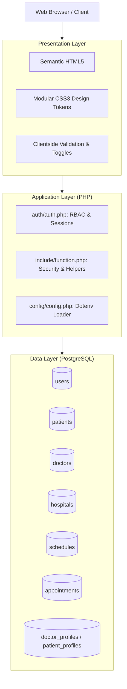

# NovaCare: Technical Project Documentation & Presentation Guide

## 1. Project Overview & Core Mission
**NovaCare** is a full-stack Healthcare Provider Coordination and Appointment Management Platform developed with **PHP 8.x** and **PostgreSQL**. It connects three distinct user roles into a single ecosystem:

1. **Patients:** Discover verified doctors and hospitals, book scheduled consultations, and manage medical visit records.
2. **Doctors:** Manage weekly consultation hours across affiliated hospitals, review patient queues, and confirm or complete appointments.
3. **Hospital Administrators:** Oversee clinical credentials, verify medical licenses, approve provider schedules, and coordinate network hospitals.

---

## 2. System Architecture & Tech Stack

* **Frontend:** Semantic HTML5, CSS3 with unified design tokens (warm palette: oat, cherry, olive, butter), vanilla JavaScript.
* **Backend:** PHP 8 with modern PDO (PHP Data Objects) for prepared statements and transaction isolation.
* **Database:** PostgreSQL (relational integrity, foreign key cascades, check constraints, indexed lookup, compatibility views).
* **Architecture Pattern:** Modular MVC-inspired architecture with separated authentication middleware, shared configuration, and role-based portal routing.

---

## 3. Directory Structure & File Breakdown

| Directory / File | Description & Purpose |
|---|---|
| [`index.php`](file:///d:/Nova-Care/index.php) | **Public Landing Page:** Displays dynamic hero section, live database statistics (active hospitals, verified doctors, booking completion rate), featured doctors/hospitals, and role-aware navigation. |
| [`login.php`](file:///d:/Nova-Care/login.php) | **Unified Authentication Portal:** Single sign-in interface supporting Patient, Doctor, and Admin roles with role auto-detection, password show/hide, and return redirection. |
| [`logout.php`](file:///d:/Nova-Care/logout.php) | **Session Termination:** Destroys active session cookies, clears session arrays, and securely redirects to home. |
| [`auth/auth.php`](file:///d:/Nova-Care/auth/auth.php) | **Authentication Engine:** Enforces role-based access control (`require_login()`), session fixation prevention, 30-minute idle session timeout, and identity validation. |
| [`config/config.php`](file:///d:/Nova-Care/config/config.php) | **Environment Configuration:** Reads `.env` settings via Composer Dotenv to securely configure PostgreSQL credentials without hardcoding secrets. |
| [`database/db.php`](file:///d:/Nova-Care/database/db.php) | **Database Connection:** Provides a singleton `getDB()` PDO connection configured with strict error modes and emulated prepares disabled. |
| [`database/db.sql`](file:///d:/Nova-Care/database/db.sql) | **Database Blueprint:** Defines all 8 tables, indexes, constraints, compatibility views, and initial seed data. |
| [`include/function.php`](file:///d:/Nova-Care/include/function.php) | **Core Utility Library:** Sanitization (`clean()`), CSRF token generation/verification, doctor ID generator (`DOC-XXXX`), appointment token generator (`TK-YYYYMMDD-XXXX`), file upload handlers. |
| [`includes/functions.php`](file:///d:/Nova-Care/includes/functions.php) | **Compatibility Bridge:** Legacy wrapper ensuring admin scripts locate helper functions without path discrepancies. |
| [`registration/account_selection.php`](file:///d:/Nova-Care/registration/account_selection.php) | **Role Selection Screen:** Visual choice cards for Patient vs Doctor registration with feature comparison and step-by-step onboarding walkthrough. |
| [`registration/patient_registration.php`](file:///d:/Nova-Care/registration/patient_registration.php) | **Patient Signup:** Single centered form collecting personal, demographic, and emergency contact details with atomic DB transactions. |
| [`registration/doctor_registration.php`](file:///d:/Nova-Care/registration/doctor_registration.php) | **Doctor Credential Application:** Intake for medical licenses, qualifications, specialization, and profile photo, submitting accounts under `pending` verification. |
| [`patient/dashboard.php`](file:///d:/Nova-Care/patient/dashboard.php) | **Patient Portal:** Overview of personal appointments, live status indicators, appointment cancellation, and health record summary. |
| [`patient/appointment.php`](file:///d:/Nova-Care/patient/appointment.php) | **Booking Engine:** Lets authenticated patients select from verified specialists, choose dates and time slots, and receive an appointment tracking token. |
| [`doctor/dashboard.php`](file:///d:/Nova-Care/doctor/dashboard.php) | **Doctor Clinical Portal:** Overview of today's patient queue, pending appointment requests, confirmation/completion actions, and verification status. |
| [`doctor/schedule.php`](file:///d:/Nova-Care/doctor/schedule.php) | **Consultation Slot Manager:** Enables doctors to define weekly availability (day, hospital, time window, slot duration) for patient booking. |
| [`admin/dashboard.php`](file:///d:/Nova-Care/admin/dashboard.php) | **Administrative Command Center:** Hospital-wide KPI statistics, recent signups, pending doctor credentials, and schedule approvals. |
| [`admin/verify_doctor.php`](file:///d:/Nova-Care/admin/verify_doctor.php) | **Doctor Verification Module:** Clinical board review interface to inspect licenses and approve or reject doctor applications. |
| [`admin/hospitals.php`](file:///d:/Nova-Care/admin/hospitals.php) | **Hospital Registry:** Manage affiliated clinics, emergency lines, departments, and doctor-hospital relationships. |
| [`admin/appointments.php`](file:///d:/Nova-Care/admin/appointments.php) | **Master Appointment Queue:** System-wide appointment status monitor with automated email alerts to patients. |
| [`admin/schedule_approval.php`](file:///d:/Nova-Care/admin/schedule_approval.php) | **Schedule Review:** Approves or rejects doctor consultation slots prior to public visibility. |
| [`assets/css/main/style.css`](file:///d:/Nova-Care/assets/css/main/style.css) | **Landing Page Styles:** Extracted CSS with responsive layouts, typography, and color tokens for `index.php`. |
| [`assets/css/auth.css`](file:///d:/Nova-Care/assets/css/auth.css) | **Unified Portal Stylesheet:** Clean, responsive styling for login, registration, and dashboards. |

---

## 4. Key Terminology & Concepts (Viva / Defense Prep)

### "Private by Design"
* **What it means in your project:** Patient health information is strictly segmented. 
* **Implementation:** A patient can only view their own records (`WHERE patient_id = :session_id`). A doctor can only access details for patients who have actively booked an appointment with them. Raw medical queries are never exposed without authentication checks.

### "HIPAA-Ready Security"
The **Health Insurance Portability and Accountability Act (HIPAA)** governs the security and privacy of electronic Protected Health Information (ePHI). In this application, "HIPAA-ready" encompasses four engineering pillars:
1. **Access Control (RBAC):** Strict separation between `patient`, `doctor`, and `admin` enforced at the server level via `require_login(['role'])`.
2. **Cryptographic Protection:** Passwords are never stored in plaintext; they use one-way salted `bcrypt` algorithms (`PASSWORD_DEFAULT` with cost 12).
3. **Session Hardening:** Cookies are configured with `HttpOnly` (mitigates Cross-Site Scripting cookie theft), `SameSite=Lax` (mitigates CSRF), and an inactivity timeout of 1,800 seconds (30 minutes).
4. **Audit Trail & Integrity:** Critical records contain immutable timestamps (`created_at`, `updated_at`, `verified_at`, `reviewed_at`) and verified admin foreign keys.

### Dynamic Verification Flow (Why Doctors Aren't Immediately Active)
* When a doctor registers, their account is given `status = 'pending'` and `verification_status = 'pending'`.
* This prevents unauthorized individuals from advertising medical services.
* An administrator must inspect their medical license number in `admin/verify_doctor.php` before the doctor becomes bookable by patients.

---

## 5. Typical Presentation Q&A

> **Q: How does the system prevent SQL injection?**  
> **A:** All database communication is handled through PDO using prepared statements with parameter binding (`prepare()` and `execute([$param])`). Emulated prepares are disabled in `db.php` (`ATTR_EMULATE_PREPARES => false`), ensuring the SQL engine treats input strictly as data, never as executable SQL.

> **Q: What happens if an unauthenticated user tries to book an appointment?**  
> **A:** The system enforces gatekeeping. If a guest clicks "Book Appointment", they are redirected to `login.php?redirect=patient/appointment.php`. Once they sign in or register, they are automatically forwarded back to their intended booking page.

> **Q: How are doctor schedules converted into patient appointment slots?**  
> **A:** Doctors define availability blocks (e.g. Monday 9:00 AM – 1:00 PM with 20-minute slots) tied to a partner hospital. Patients select a time slot within that window, which creates an appointment record with a unique tracking token (`TK-YYYYMMDD-XXXX`).
